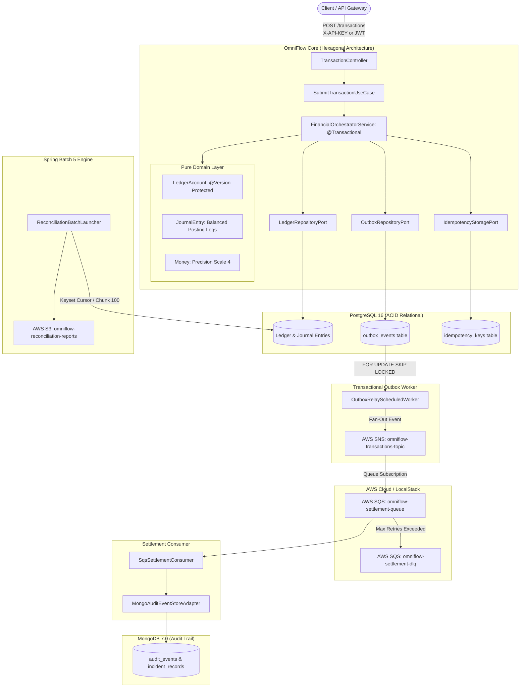

# OmniFlow

Financial transaction orchestration and multi-party settlement platform built with Java 17, Spring Boot, PostgreSQL, MongoDB, and AWS messaging services (SNS / SQS / S3).

[](https://www.oracle.com/java/)
[](https://spring.io/projects/spring-boot)
[](https://www.postgresql.org/)
[](https://www.mongodb.com/)
[](https://localstack.cloud/)
[](LICENSE)

---

## Overview

OmniFlow orchestrates high-volume financial transactions across multi-party marketplace splits and asynchronous clearing pipelines. It enforces transactional consistency, prevents dual-write anomalies across relational and cloud message systems, and validates ledger balances through keyset-paginated reconciliation.

Key capabilities:
- **Dual-Write Consistency:** Guarantees atomic state transitions between PostgreSQL and AWS SNS/SQS via Transactional Outbox with `SELECT ... FOR UPDATE SKIP LOCKED` polling (at-least-once delivery).
- **Multi-Leg Marketplace Settlement:** Atomically executes 4-way splits per payment (buyer debit, merchant payout, platform commission, and dispute escrow reserve).
- **Distributed Idempotency:** SHA-256 fingerprinting with atomic relational table leases (`IN_FLIGHT` with lease expiry and `COMPLETED` cached responses).
- **Chunk-Based Keyset Reconciliation:** Spring Batch 5 engine processing ledger entries using keyset cursors (`WHERE entry_id > :lastId`) to audit balances without loading full tables into memory.
- **Resilient Message Quarantine & DLQ Replay:** Isolates corrupted or poison-pill messages into dead-letter queues while supporting audited replay operations.
- **Role-Based Access Control (RBAC):** Dual-layer authentication supporting OAuth2 JWT Bearer tokens and M2M API Keys.

---

## Architecture



---

## Key Engineering Highlights

### 1. Multi-Party Double-Entry General Ledger
Every transaction records immutable, balanced journal postings with credit and debit legs:
- **4-Leg Marketplace Settlement Split:**
  ```text
  $1,000.00 Gross Transaction
  ├── Buyer Deposit Account (Liability)        -1000.00
  ├── Merchant Payout Account (Liability)       +930.00
  ├── Platform Commission (Revenue)              +50.00
  └── Chargeback Escrow Reserve (Liability)      +20.00
  ─────────────────────────────────────────────────────
  Net Transaction Balance                         0.00
  ```
- Balance mutations use JPA `@Version` optimistic locking to detect concurrent conflicting updates without table locks.
- Overdraft protection is governed per account (`allowOverdraft = false` rejects transactions that would deplete deposit accounts).

### 2. Transactional Outbox (`SKIP LOCKED` Polling)
Eliminates dual-write inconsistencies between PostgreSQL and AWS SNS:
- The transaction state, ledger entries, and outbox event are committed in the same relational transaction.
- The `OutboxRelayScheduledWorker` fetches batches using:
  ```sql
  SELECT * FROM outbox_events 
  WHERE status IN ('PENDING', 'FAILED') AND retry_count < 3 
  ORDER BY created_at ASC
  FOR UPDATE SKIP LOCKED 
  LIMIT 50;
  ```
- Unclaimed rows are picked up concurrently by sibling pods without lock contention. Failed dispatches back off exponentially with jitter.

### 3. Distributed SHA-256 Idempotency Engine
- Calculates a SHA-256 hash across `referenceId|debtor|creditor|amount|currency|payload`.
- Handles concurrent request races using an atomic `IN_FLIGHT` lease. Expired leases from crashed pods are automatically reclaimed on retry.
- Reusing an identical key with altered payload values triggers an immediate `409 Conflict` (`ConflictingPayloadException`).

### 4. Keyset-Based Spring Batch 5 Reconciliation
- `ledgerItemReader` streams PostgreSQL records using keyset pagination (`WHERE entry_id > :lastId AND timestamp <= :cutoff ORDER BY entry_id ASC`). Memory consumption remains constant regardless of whether 1,000 or 10,000,000 records are reconciled.
- Aggregates discrepancy reports and writes immutable JSON audit summaries to **AWS S3**.

### 5. Resilient Message Quarantine & Poison-Pill Isolation
Settlement consumer failures are categorized into distinct operational classes:
- **Transient Failures (e.g. SQS throttling, DB pool saturation):** Retried automatically with exponential backoff and jitter.
- **Semantic / Poison Pills (e.g. malformed payloads, currency mismatch):** Quarantined into the Dead-Letter Queue (DLQ) after retry limits to avoid blocking consumer threads.
- Diagnostic metadata and stack traces are captured to MongoDB for operator review and audited replay.

---

## Failure Scenarios & Mitigation

| Scenario | Failure Mode | OmniFlow Mitigation | Test Verification |
|---|---|---|---|
| **Dual-Write** | DB commits but message broker unreachable | Transactional Outbox persisted in same ACID transaction; polled via `FOR UPDATE SKIP LOCKED` | `FinancialOrchestratorService` |
| **Worker Crash** | Pod terminated while publishing event | Outbox lease timeout (`locked_at < now - 5m`) automatically reclaims stale events | `PostgresOutboxRepositoryAdapter` |
| **Broker Backpressure** | SNS/SQS throttles requests with 429 | Exponential backoff with randomized jitter | `OutboxRelayScheduledWorker` |
| **Duplicate Delivery** | At-least-once SQS delivery duplicates event | Consumer deduplication store (`processed_settlement_events`) with atomic reservation | `SqsConsumerIdempotencyTest` |
| **Concurrent Debit Race** | Simultaneous debits on single account | JPA `@Version` optimistic locking aborts conflicting updates | `LedgerOptimisticLockingConcurrencyTest` |
| **Payload Tampering** | Reused idempotency key with different amount | SHA-256 fingerprint mismatch returns `409 Conflict` | `FinancialOrchestratorService` |
| **Reconciliation Memory Spike** | Large tables cause OOM during audit runs | Keyset cursor pagination bounded by page size | `ReconciliationKeysetPaginationTest` |
| **Poison Pill Message** | Corrupted message body crashes consumer loop | SQS Dead-Letter Queue (DLQ) isolation after 3 retries | `IncidentTriageTest` |

---

## Technology Stack

| Layer | Technology | Purpose |
|---|---|---|
| **Runtime** | Java 17 LTS | Records, Pattern Matching, Sealed Types |
| **Framework** | Spring Boot 3.3.4 | Core framework, Spring Data JPA, Actuator |
| **Relational DB** | PostgreSQL 16 | ACID transactions, Flyway migrations |
| **NoSQL DB** | MongoDB 7.0 | Append-only audit logs & event history |
| **Cloud Services** | Spring Cloud AWS 3.2.1 | SNS (Fan-out), SQS (Queues & DLQ), S3 (Reconciliation reports) |
| **Local Cloud** | LocalStack 3.7 | Local AWS emulation |
| **Batch Engine** | Spring Batch 5 | Keyset cursor reconciliation |
| **Rate Limiting** | Bucket4j | Token-bucket rate limiting filter |
| **Architecture Testing** | ArchUnit + JUnit 5 | Hexagonal boundary enforcement, Concurrency tests |

---

## Getting Started

### Prerequisites
- **Java 17 LTS**
- **Docker & Docker Compose**
- **Maven 3.9+** (or included `./mvnw`)

### 1. Start Backing Infrastructure (PostgreSQL, MongoDB, LocalStack)
```bash
docker compose up -d
```

### 2. Run Test Suite
```bash
# Linux / macOS
./mvnw clean test

# Windows PowerShell
.\mvnw.cmd clean test
```

### 3. Start the Application
```bash
# Linux / macOS
./mvnw spring-boot:run

# Windows PowerShell
.\mvnw.cmd spring-boot:run
```

---

## REST API Reference

### Submit Financial Transaction
`POST /api/v1/transactions`

**Headers:**
- `X-API-KEY: omniflow-master-key`
- `Idempotency-Key: IDEMP-TX-90210`
- `Content-Type: application/json`

**Request Body:**
```json
{
  "referenceId": "INV-2026-001",
  "debtorAccount": "OMNI:0001:ACC-100",
  "creditorAccount": "OMNI:0001:ACC-200",
  "amount": 250.00,
  "currency": "USD",
  "description": "Supplier Settlement Payment"
}
```

### Run Batch Reconciliation
`POST /api/v1/reconciliation/run?date=2026-09-11`

**Headers:**
- `X-API-KEY: omniflow-master-key`

Triggers chunk-based keyset reconciliation against the ledger, emitting an audit summary report to AWS S3.

---

## License

OmniFlow is licensed under the [Apache 2.0 License](LICENSE).
