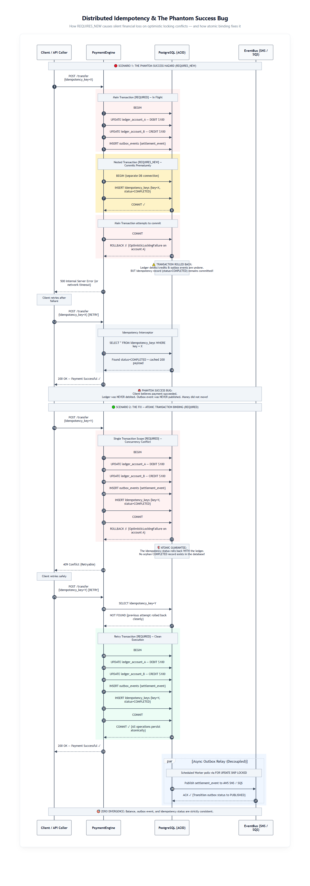

# OmniFlow — Orquestração Financeira & Reconciliação na Nuvem

> Motor de liquidação e conciliação contábil para marketplaces e splits multi-partes em Java 17 e Spring Boot 3. Projetado para eliminar escrita dupla (*Dual-Write*) entre PostgreSQL e AWS SNS/SQS, garantir o invariante contábil de soma zero ($\sum D = \sum C$) e reconciliar milhões de transações via Spring Batch 5 com memória constante $O(1)$.

[](https://openjdk.org/)
[](https://spring.io/projects/spring-boot)
[](https://www.postgresql.org/)
[](https://www.mongodb.com/)
[](https://localstack.cloud/)
[-success.svg)]()
[](LICENSE)

> [!NOTE]
> **Executive Summary (EN):** OmniFlow is an institutional financial engine built with Hexagonal Architecture in Java 17 and Spring Boot 3. It orchestrates high-throughput marketplace split settlements across distributed ledger accounts, eliminates relational-to-broker dual-write issues via the Transactional Outbox pattern (`PostgreSQL FOR UPDATE SKIP LOCKED` $\rightarrow$ AWS SNS/SQS), enforces cryptographic distributed idempotency (SHA-256 against the Phantom Success Bug), and reconciles millions of journal entries nightly using Spring Batch 5 with bounded $O(1)$ memory keyset pagination.

---

## Por que este projeto existe? (O Desafio de Engenharia)

Em plataformas de pagamento e marketplaces (estilo Uber, iFood ou plataformas de e-commerce), o dinheiro quase nunca vai de uma conta A para uma conta B de forma direta:
- O cliente passa o cartão em R$ 1.000,00.
- Desse valor, **R$ 930,00** vão para o lojista/prestador de serviço.
- **R$ 50,00** ficam com a plataforma como comissão (*take-rate*).
- **R$ 20,00** ficam retidos em uma conta de caução/escrow para cobrir eventuais disputas ou chargebacks.

Se qualquer uma dessas 4 pernas contábeis falhar no meio do caminho, o livro-razão financeiro fica desbalanceado.

E pior: para avisar os outros serviços da nuvem (antifraude, emissão de nota fiscal, repasse bancário), a aplicação precisa falar com o banco de dados relacional (PostgreSQL) e publicar eventos no broker de mensagens (**AWS SNS / SQS**). 

Se o seu pod da aplicação for reiniciado pelo Kubernetes no milissegundo exato entre o commit do PostgreSQL e a chamada de rede da AWS, você acabou de criar o pesadelo do **Dual-Write**: o banco debitou o cliente, mas o evento nunca chegou na fila de liquidação externa.

O **OmniFlow** foi desenhado com Arquitetura Hexagonal pura para resolver esse fluxo ponta a ponta: do split multi-partes à publicação garantida e reconciliação em lote.

---

## O Fluxo de Liquidação

```mermaid
flowchart TD
    Client([Cliente / API Gateway]) -->|POST /transactions com Idempotency-Key| WebAdapter[TransactionController]

    subgraph Core ["OmniFlow Core (Hexagonal & ACID)"]
        WebAdapter --> InPort[SubmitTransactionUseCase]
        InPort --> Orchestrator[FinancialOrchestratorService: @Transactional]

        subgraph Domain ["Domínio Contábil Puro"]
            LedgerAccount[LedgerAccount: Protegido por @Version]
            JournalEntry[JournalEntry: Split de 4 Pernas Balanceadas]
            Money[Money: Precisão Decimal Estrita]
        end

        Orchestrator --> Domain
        Orchestrator --> OutboxPort[OutboxRepositoryPort: Tabela outbox_events]
        Orchestrator --> LedgerPort[LedgerRepositoryPort: PostgreSQL ACID]
        Orchestrator --> IdempPort[IdempotencyStoragePort: Tabela idempotency_keys]
    end

    subgraph OutboxWorker ["Worker de Despacho Concorrente"]
        OutboxPort -->|SELECT ... FOR UPDATE SKIP LOCKED| OutboxRelay[OutboxRelayScheduledWorker]
        OutboxRelay -->|Fan-Out sem Dual-Write| SNS[AWS SNS Topic]
    end

    subgraph AWS ["AWS Messaging & Storage"]
        SNS --> SQS[AWS SQS Queue]
        SQS --> DLQ[AWS SQS Dead-Letter Queue]
    end

    subgraph Consumer ["Consumidor com Desduplicação"]
        SQS --> SqsListener[SqsSettlementConsumer: Reserva Atômica de ID]
        SqsListener --> MongoStore[MongoAuditEventStoreAdapter: Log Imutável de Auditoria]
    end

    subgraph BatchEngine ["Reconciliação Noturna (Spring Batch 5)"]
        BatchLauncher[ReconciliationBatchLauncher] -->|Cursor Keyset O(1)| LedgerPort
        BatchLauncher --> S3[AWS S3: Relatórios Periciais JSON]
    end
```

---

## Padrões Arquiteturais e Decisões de Produção

### 1. Splits de 4 Pernas em Transação Atômica Única
Cada pagamento é registrado como uma única entrada de diário contábil (`JournalEntry`) com 4 lançamentos atômicos obedecendo ao princípio de Luca Pacioli ($\sum \text{Débitos} = \sum \text{Créditos}$):
```text
R$ 1.000,00 Valor Bruto da Transação
├── Conta de Depósito do Comprador (Passivo)     -1000.00
├── Conta de Repasse do Lojista (Passivo)         +930.00
├── Conta de Receita da Plataforma (Receita)       +50.00
└── Reserva de Caução para Disputas (Passivo)      +20.00
─────────────────────────────────────────────────────────
Saldo Líquido da Movimentação                        0.00 (Invariante Zero-Sum)
```
Não existe meio-termo: ou as 4 pernas entram no banco de dados juntas, ou nenhuma entra.

### 2. Transactional Outbox com `FOR UPDATE SKIP LOCKED`
Para eliminar a perda de mensagens e a escrita dupla (*dual-write*):
- O evento de domínio é gravado na tabela `outbox_events` na mesma transação relacional que muta os saldos das contas.
- O `OutboxRelayScheduledWorker` busca os eventos pendentes utilizando concorrência distribuída no PostgreSQL:
  ```sql
  SELECT * FROM outbox_events 
  WHERE status IN ('PENDING', 'FAILED') AND retry_count < 3 
  ORDER BY created_at ASC
  FOR UPDATE SKIP LOCKED 
  LIMIT 50;
  ```
- O diferencial do `SKIP LOCKED`: múltiplas instâncias da aplicação em um cluster Kubernetes concorrem pela fila sem contenção de locks de linha. Cada réplica reivindica um lote independente de registros e pula os que já estão bloqueados por pods vizinhos.
- Se o broker AWS estiver sob estrangulamento (throttling 429), o worker aplica retentativa com backoff exponencial ($\min(300\text{s}, 2 \cdot 2^{\text{retry}})$) e jitter aleatório.

### 3. Reconciliação Keyset no Spring Batch 5 (Memória Bounded $O(1)$)
A maioria dos sistemas comete o erro de auditar o livro-razão usando paginação tradicional por offset (`LIMIT 100 OFFSET 1000000`). No PostgreSQL, o banco precisa escanear 1 milhão de tuplas em disco para descartá-las e entregar apenas as 100 seguintes. Conforme o volume de transações cresce, o tempo de query salta de 5ms para 40 segundos, provocando degradação severa e estouro de memória heap da JVM.

No OmniFlow, o leitor de lote (`ledgerItemReader`) adota **paginação Keyset com corte temporal (temporal cutoff)**:
```sql
SELECT * FROM ledger_entries 
WHERE entry_id > :lastId AND created_at <= :cutoff 
ORDER BY entry_id ASC 
LIMIT 100;
```
O banco navega diretamente pelo índice da chave primária (`entry_id`). A consulta é executada em tempo submilisegundo ($O(1)$) independentemente de estar na primeira ou na milionésima página. O consumo de memória heap permanece estritamente constante e previsível.

### 4. Isolamento Determinístico de Mensagens Venenosas (Dead-Letter Queue)
Mensagens corrompidas ou violadoras de contrato que chegam ao SQS não causam laços infinitos de erro:
- Após 3 tentativas falhas com backoff, a mensagem é isolada na **Dead-Letter Queue (DLQ)**.
- O serviço de triagem forense (`IncidentTriageService`) inspeciona o payload bruto, correlaciona com a trilha de auditoria no MongoDB e aplica salvaguardas financeiras (*Human-in-the-Loop* obrigatório para transações acima do teto prudencial).

### 5. Idempotência Distribuída & O Bug do Sucesso Fantasma (*The Phantom Success Bug*)
Um dos erros mais perigosos em sistemas bancários distribuídos é gerenciar o registro de idempotência em uma transação aninhada independente (`@Transactional(propagation = Propagation.REQUIRES_NEW)`):
- **O Risco (Cenário 1):** Se o registro de idempotência commitar prematuramente em sua própria conexão e a transação principal sofrer um conflito de concorrência (`OptimisticLockException`), os débitos no saldo sofrem rollback, mas o registro `COMPLETED` permanece salvo. Quando o cliente retenta a chamada, o interceptor encontra a chave, responde `HTTP 200 OK`, mas o dinheiro **nunca foi transferido**.
- **A Solução Atômica (Cenário 2):** Amarração estrita de escopo transacional (`REQUIRED`). Toda mutação de saldo, evento outbox e registro de idempotência comitam ou sofrem rollback juntos. Em caso de conflito, o cliente recebe `HTTP 409 Conflict` e pode retentar com garantia de zero divergência contábil.

<p align="center">
  
</p>

---

## Melhorias de Arquitetura para Alta Escala

### A. Compensação Contínua (Multilateral Netting)
Em vez de disparar uma liquidação externa individual para cada venda do marketplace (o que gera centenas de milhares de reais em tarifas bancárias e imobiliza liquidez):
- Janelas de compensação líquida periódica (ex: ciclos de 5 minutos).
- O motor consolida todos os débitos e créditos mútuos entre lojistas e plataforma, liquidando apenas a obrigação financeira líquida apurada.

### B. Trilha Contábil Criptográfica (Merkle Ledger Audit)
Para garantir que nenhum acesso administrativo indevido altere um saldo direto no banco de dados (`UPDATE accounts SET balance = ...`):
- Cada lançamento contábil carrega um hash criptográfico encadeado (`HMAC-SHA256`) do registro anterior.
- A reconciliação do Spring Batch valida não só os saldos matemáticos, mas a integridade da cadeia de blocos. Qualquer adulteração direta quebra a cadeia de auditoria no primeiro centavo modificado.

---

## Endpoints REST Principais

| Método | Rota | Descrição | Autenticação |
| :--- | :--- | :--- | :--- |
| `POST` | `/api/v1/transactions` | Submete pagamento com split contábil multi-partes e chave de idempotência | JWT / `X-API-KEY` |
| `POST` | `/api/v1/incidents/triage` | Triagem determinística forense de mensagens venenosas (DLQ) com salvaguardas | JWT / `X-API-KEY` |
| `POST` | `/api/v1/reconciliation/run` | Dispara o job de reconciliação contábil noturna (Spring Batch 5) | JWT / `X-API-KEY` |
| `GET` | `/actuator/health` | Status de saúde da aplicação e integridade dos bancos e brokers | Pública |
| `GET` | `/actuator/prometheus` | Métricas operacionais em tempo real para observabilidade | Pública |

---

## Documentação Técnica & Decisões de Arquitetura

O OmniFlow conta com documentação aprofundada de arquitetura de software e governança técnica:

- 📐 **[Diagramas de Arquitetura (C4 Model & Sequência)](docs/ARCHITECTURE_DIAGRAMS.md):**
  - **C4 Nível 1 (Contexto):** Relação entre clientes de marketplace, OmniFlow Core, AWS SNS/SQS, S3 e bancos de dados.
  - **C4 Nível 2 (Contêineres):** Web API, Outbox Relay Worker, Consumidor SQS e Engine de Reconciliação em Lote.
  - **C4 Nível 3 (Componentes):** Arquitetura Hexagonal desacoplada entre Inbound/Outbound Adapters e Domínio Contábil.
  - **Diagrama de Sequência:** Fluxo síncrono e transacional de split contábil de 4 pernas.
  - **Diagrama de Entrega Assíncrona:** Ciclo de vida do Transactional Outbox até fan-out AWS SNS e desduplicação no SQS.

- 📜 **[Architecture Decision Records (ADRs)](docs/adr/README.md):**
  - **[ADR-001](docs/adr/ADR-001-transactional-outbox-skip-locked.md):** Eliminação de escrita dupla com Outbox Pattern e `FOR UPDATE SKIP LOCKED`.
  - **[ADR-002](docs/adr/ADR-002-double-entry-general-ledger.md):** Livro-razão contábil de dupla entrada com garantia de invariante zero-sum.
  - **[ADR-003](docs/adr/ADR-003-polyglot-persistence-postgres-mongodb.md):** Persistência poliglota isolando ACID (PostgreSQL) de logs periciais imutáveis (MongoDB).
  - **[ADR-004](docs/adr/ADR-004-deterministic-ai-agent-guardrails.md):** Triagem determinística de incidentes em DLQ e esteira de salvaguardas operacionais.
  - **[ADR-005](docs/adr/ADR-005-sha256-distributed-idempotency.md):** Idempotência com hash SHA-256 e prevenção ao *Phantom Success Bug* via escopo `REQUIRED`.
  - **[ADR-006](docs/adr/ADR-006-reconciliation-keyset-pagination-and-lease-recovery.md):** Reconciliação em lote $O(1)$ por cursor keyset e recuperação de leases de outbox.

---

## Stack Tecnológica

* **Java 17 LTS:** Records, Pattern Matching, Sealed Types, Arquitetura Hexagonal pura.
* **Spring Boot 3.3.4:** Core framework, Spring Data JPA, Actuator, Micrometer.
* **PostgreSQL 16:** Banco transacional ACID com versionamento otimista (`@Version`).
* **MongoDB 7.0:** Armazenamento append-only de logs de auditoria e triagem de incidentes.
* **AWS Cloud / LocalStack 3.7:** Emulação completa de AWS SNS, SQS e S3.
* **Batch:** Spring Batch 5 para processamento em lotes com cursores keyset.
* **Segurança:** Suporte duplo a OAuth2 JWT e chaves de máquina M2M (`X-API-KEY`).
* **Resiliência:** Bucket4j para rate limiting defensivo e backoff exponencial com jitter.

---

## Como Rodar Localmente

### 1. Subir a Infraestrutura (PostgreSQL, MongoDB e LocalStack AWS)
```bash
docker compose up -d
```

### 2. Executar a Suíte de Testes
```bash
# Windows
.\mvnw.cmd clean test

# Linux / macOS
./mvnw clean test
```

A suíte conta com **34 testes automatizados** cobrindo:
- **Domínio Contábil Puro:** Regra de ouro da partida dobrada ($\sum D = \sum C$), validação de precisão decimal estrita (`Money`) e cálculos de take-rate de marketplace.
- **Idempotência Distribuída:** Bloqueio atômico de chaves duplicadas com hash SHA-256 no escopo transacional `REQUIRED`.
- **Worker de Outbox:** Despacho concorrente `SKIP LOCKED`, retentativa com backoff exponencial + jitter e circuit breaker contra indisponibilidade de broker.
- **Tratamento Global de Exceções:** Contrato RFC 7807 (`ProblemDetail`) garantindo zero vazamento de 500 para erros de cliente (400, 405, 409, 422).
- **Filtros de Segurança:** Autenticação segura por chave de API com tempo constante (`MessageDigest.isEqual`) e rate limiting em memória com descarte anti-OOM.

### 3. Subir a Aplicação
```bash
# Windows
.\mvnw.cmd spring-boot:run

# Linux / macOS
./mvnw spring-boot:run
```

---

## Licença

Distribuído sob a licença [Apache 2.0](LICENSE).
