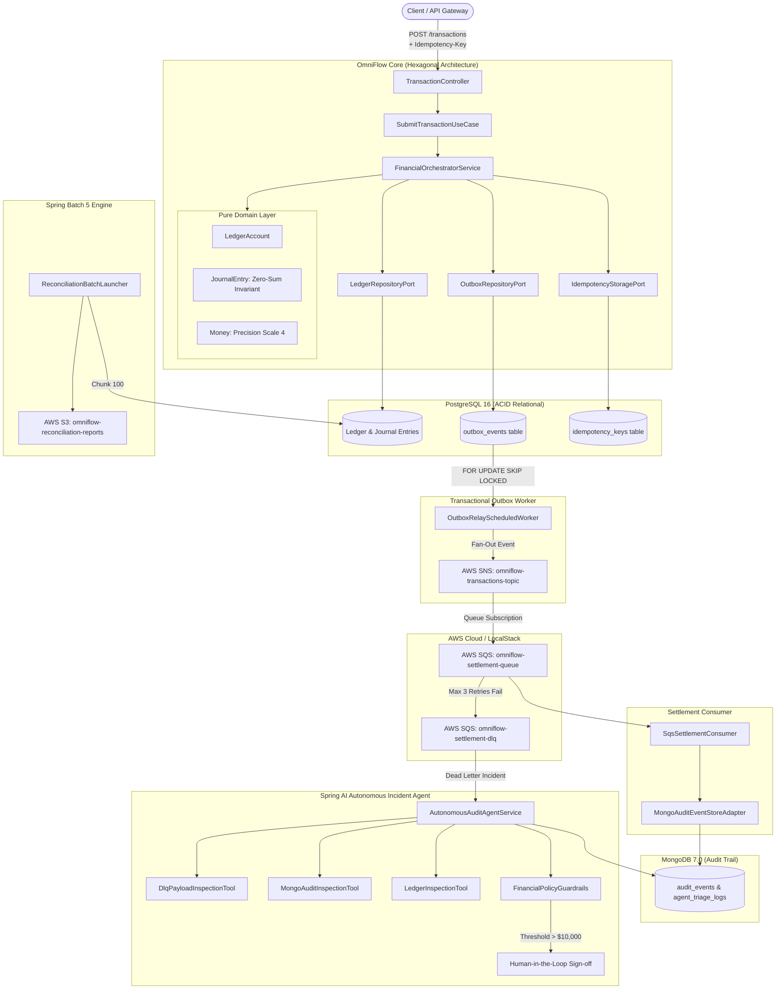

# OmniFlow ⚡
### Cloud-Native Autonomous Financial Orchestration & Settlement Platform

[](https://www.oracle.com/java/)
[](https://spring.io/projects/spring-boot)
[](https://www.postgresql.org/)
[](https://www.mongodb.com/)
[](https://localstack.cloud/)
[](https://spring.io/projects/spring-ai)
[]()
[](LICENSE)

---

## 🏛️ Executive Summary

**OmniFlow** is a production-grade, distributed financial orchestration and settlement engine designed to handle mission-critical payments, automated double-entry ledger bookkeeping, asynchronous message settlement, and autonomous AI-driven incident triage.

Built with **Hexagonal Architecture (Ports and Adapters)** and **Domain-Driven Design (DDD)**, OmniFlow solves the hardest problems in modern financial engineering:
* **Dual-Write Hazards:** Eliminated via the **Transactional Outbox Pattern** with PostgreSQL `SKIP LOCKED` polling.
* **Network Duplication & Retries:** Guaranteed by a **SHA-256 Distributed Idempotency Engine** supporting `IN_FLIGHT` locking and cached results.
* **Ledger Imbalances & Concurrency Races:** Prevented via strict **Double-Entry Zero-Sum Invariants** ($\sum \text{Debits} = \sum \text{Credits}$) and JPA `@Version` **Optimistic Locking**.
* **Poison-Pill & DLQ Triage:** Resolved autonomously by a **Spring AI Autonomous Agent** executing deterministic diagnostic `@Tool` inspections governed by hard **Financial Policy Safety Guardrails** and Human-in-the-Loop (HITL) approval thresholds.

---

## 📐 Architecture Diagram



---

## 🚀 Key Engineering Highlights

### 1. Mathematical Double-Entry General Ledger
Every transaction consists of at least two posting legs. The domain model strictly enforces:
$$\sum \text{Debits} = \sum \text{Credits}$$
* **Asset & Expense accounts:** Debits *increase* balance; Credits *decrease* balance.
* **Liability, Equity & Revenue accounts:** Credits *increase* balance; Debits *decrease* balance.
* Overdraft protection is verified on the balance object; unauthorized negative balances throw `InsufficientFundsException`.
* Optimistic concurrency is guaranteed using `@Version` to eliminate lost updates.

### 2. Transactional Outbox with `FOR UPDATE SKIP LOCKED`
Dual-write anomalies between PostgreSQL and message brokers (SNS/SQS) are fundamentally impossible:
* The transaction state, journal entry, and outbox event are saved within the **same atomic database transaction**.
* The `OutboxRelayScheduledWorker` fetches batches using:
  ```sql
  SELECT * FROM outbox_events 
  WHERE status IN ('PENDING', 'FAILED') AND retry_count < 5 
  FOR UPDATE SKIP LOCKED 
  LIMIT 50;
  ```
* Supports multi-instance scaling without race conditions or distributed table locks.

### 3. Distributed SHA-256 Idempotency Engine
* Calculates a deterministic SHA-256 fingerprint over `referenceId|debtor|creditor|amount|currency|payload`.
* Atomic `tryAcquire`:
  * Returns cached `TransactionResult` if `COMPLETED`.
  * Detects concurrent requests and rejects duplicate processing with `409 Conflict`.
  * Flags payload tampering if the same idempotency key is submitted with different payload data.

### 4. Autonomous AI Agent with Deterministic Guardrails
* Triggered automatically upon DLQ dead-letter events or ledger discrepancies.
* Discovers and calls tools via reflection and Spring AI:
  * `DlqPayloadInspectionTool`: Diagnoses payload schema defects and transient network aborts.
  * `MongoAuditInspectionTool`: Reconstructs chronological audit trail from MongoDB.
  * `LedgerInspectionTool`: Verifies current ledger state and account balances.
* **Safety Guardrails (`FinancialPolicyGuardrails`):**
  * Auto-remediation is blocked and routed to **Human-in-the-Loop (HITL)** if:
    1. Transaction amount exceeds **$10,000.00**.
    2. Agent confidence score is lower than **0.85**.
    3. Action requires permanent financial write-off or manual ledger adjustment.
  * Full reasoning chain, evidence, and verdict are persisted immutably in MongoDB.

### 5. High-Throughput Spring Batch 5 Reconciliation
* Chunk-oriented processing (chunk size: 100) running on Virtual Threads.
* Verifies zero-sum journal integrity across all historical ledger records.
* Formats detailed reconciliation reports and stores them directly into **AWS S3**.

---

## 🛠️ Technology Stack

| Domain | Technology | Purpose |
|---|---|---|
| **Language** | Java 17 LTS / 21 | Virtual Threads, Records, Pattern Matching, Sealed Types |
| **Framework** | Spring Boot 3.3.4 | Core framework, Actuator, Micrometer Prometheus |
| **Relational DB** | PostgreSQL 16 | ACID financial transactions, Flyway migrations |
| **NoSQL DB** | MongoDB 7.0 | Append-only immutable audit logs & AI reasoning trails |
| **Cloud Services** | Spring Cloud AWS 3.2.1 | SQS (FIFO/Standard), SNS (Fan-out), S3 |
| **Cloud Mock** | LocalStack 3.7 | Local AWS emulation with automated shell bootstrapping |
| **AI Framework** | Spring AI | Tool Calling, Diagnostic Inspections, Safety Guardrails |
| **Batch Engine** | Spring Batch 5 | Nightly Ledger Reconciliation & Discrepancy Auditing |
| **Resilience** | Bucket4j | Token-bucket rate limiting defense |
| **Quality & Arch** | ArchUnit + Testcontainers | Architectural purity verification & Container testing |

---

## 📦 Getting Started

### Prerequisites
* **Java 17+** (or Java 21)
* **Maven 3.8+**
* **Docker & Docker Compose**

### 1. Start Infrastructure (PostgreSQL, MongoDB, LocalStack)
```bash
docker compose up -d
```
The bootstrapping script `localstack-init/init-aws.sh` automatically provisions:
* S3 Bucket: `omniflow-reconciliation-reports`
* SNS Topic: `omniflow-transactions-topic`
* SQS DLQ: `omniflow-settlement-dlq`
* SQS Settlement Queue: `omniflow-settlement-queue`
* SNS $\to$ SQS Fan-Out Subscription & DLQ Redrive Policy

### 2. Build & Run Tests
```bash
mvn clean test
```
Executes all unit tests, concurrency tests, AI agent guardrail validations, and **ArchUnit architecture rules** ensuring 100% layer boundary compliance.

### 3. Launch OmniFlow
```bash
mvn spring-boot:run
```
The application starts on `http://localhost:8080` with Prometheus metrics at `http://localhost:8080/actuator/prometheus`.

---

## 📡 REST API Guide

### 1. Submit Financial Transaction
**`POST /api/v1/transactions`**
```bash
curl -X POST http://localhost:8080/api/v1/transactions \
  -H "Content-Type: application/json" \
  -H "Idempotency-Key: IDEMP-TX-90210" \
  -d '{
    "referenceId": "INV-2026-001",
    "debtorAccount": "OMNI:0001:ACC-100",
    "creditorAccount": "OMNI:0001:ACC-200",
    "amount": 250.00,
    "currency": "USD",
    "description": "Supplier Settlement Payment"
  }'
```

**Response (201 Created):**
```json
{
  "transactionId": "3fa85f64-5717-4562-b3fc-2c963f66afa6",
  "referenceId": "INV-2026-001",
  "debtorAccount": "OMNI:0001:ACC-100",
  "creditorAccount": "OMNI:0001:ACC-200",
  "amount": "250.0000",
  "currency": "USD",
  "status": "FUNDS_RESERVED",
  "failureReason": null,
  "timestamp": "2026-09-11T20:25:00Z"
}
```

### 2. Autonomous AI Agent Triage
**`POST /api/v1/ai/triage`**
```bash
curl -X POST http://localhost:8080/api/v1/ai/triage \
  -H "Content-Type: application/json" \
  -d '{
    "triggerType": "DLQ_POISON_PILL",
    "transactionId": "tx-corrupted-881",
    "payload": "{\"amount\":\"15000.00\"}",
    "errorMessage": "Schema validation failure: missing creditorAccount"
  }'
```

**Response (200 OK):**
```json
{
  "incidentId": "INCIDENT-8f12cb4a",
  "transactionId": "tx-corrupted-881",
  "rootCauseAnalysis": "Message schema corruption: creditor account field missing from SQS payload.",
  "recommendedAction": "QUARANTINE_POISON_PILL",
  "requiresHumanApproval": true,
  "confidenceScore": 0.98,
  "toolsExecuted": [
    "inspectDlqPayload",
    "queryTransactionAuditTrail"
  ],
  "evidence": { ... }
}
```

### 3. Trigger Nightly Batch Reconciliation
**`POST /api/v1/reconciliation/run?date=2026-09-11`**
```bash
curl -X POST "http://localhost:8080/api/v1/reconciliation/run?date=2026-09-11"
```

---

## 🛡️ Architecture & Verification

OmniFlow enforces strict Hexagonal Architecture constraints validated on every build via **ArchUnit**:

```java
layeredArchitecture()
    .consideringOnlyDependenciesInAnyPackage("com.omniflow..")
    .layer("Domain").definedBy("com.omniflow.domain..")
    .layer("Application").definedBy("com.omniflow.application..")
    .layer("Infrastructure").definedBy("com.omniflow.infrastructure..")
    .whereLayer("Domain").mayNotAccessAnyLayer()
    .whereLayer("Application").mayOnlyAccessLayers("Domain")
    .whereLayer("Infrastructure").mayOnlyAccessLayers("Application", "Domain");
```

---

## 🚢 Continuous Integration & Kubernetes

* **CI/CD Pipeline:** `.github/workflows/ci.yml` builds with JDK 21, runs surefire tests, uploads test reports, and scans vulnerabilities using **Aqua Security Trivy**.
* **Kubernetes Deployments:** `k8s/` contains complete manifests for Deployments, ClusterIP Services, ConfigMaps, Secrets, and Horizontal Pod Autoscalers (HPA).

---

## 📄 License
OmniFlow is licensed under the Apache 2.0 License.
