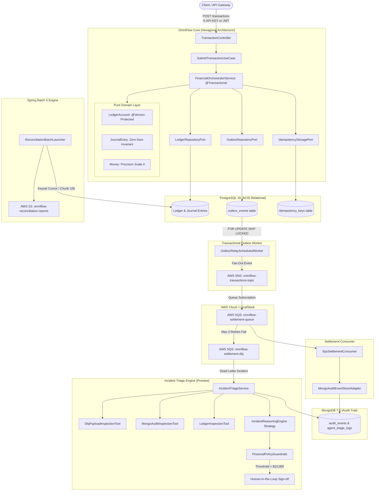

# OmniFlow ⚡
### Cloud-Native Financial Orchestration & Settlement Platform

[](https://www.oracle.com/java/)
[](https://spring.io/projects/spring-boot)
[](https://www.postgresql.org/)
[](https://www.mongodb.com/)
[](https://localstack.cloud/)
[]()
[](LICENSE)

---

## 🏛️ Overview

**OmniFlow** is a financial transaction orchestration and settlement engine built with Java 17 and Spring Boot.

The project uses Hexagonal Architecture and DDD to separate the financial domain from infrastructure concerns:
* **Dual-Write Consistency:** Prevents dual-write issues between PostgreSQL and AWS SNS/SQS using the Transactional Outbox pattern with `SKIP LOCKED` polling (at-least-once delivery).
* **Duplicate Request Handling:** Idempotency engine using SHA-256 request fingerprinting, 2-minute in-flight leases, and cached responses.
* **Ledger Balance Integrity:** Double-entry ledger with zero-sum invariant ($\sum \text{Debits} = \sum \text{Credits}$) and JPA `@Version` optimistic locking on account balances.
* **Marketplace Splits:** Divides a payment into buyer debit, merchant payout, platform commission, and escrow reserve.
* **Incident Triage:** Diagnoses DLQ messages and ledger issues, routing actions over \$10,000.00 or with confidence below 0.85 to human review.
* **Security & Access Control:** Role-Based Access Control (RBAC) supporting OAuth2 JWT Bearer tokens and API keys, Bucket4j rate limiting, and correlation IDs in logs.

---

## 📐 Architecture Diagram



---

## 🚀 Key Engineering Highlights

### 1. Mathematical Double-Entry General Ledger
Every transaction consists of at least two posting legs, enforcing the accounting equation:
$$\sum \text{Debits} = \sum \text{Credits}$$
* **Asset & Expense accounts:** Debits increase balance; Credits decrease balance.
* **Liability, Equity & Revenue accounts:** Credits increase balance; Debits decrease balance.
* Supports **4-leg Marketplace Settlement Splits**:
  ```text
  $1,000.00 Gross Transaction
  ├── Buyer Deposit Account (Liability)        -1000.00
  ├── Merchant Payout Account (Liability)       +930.00
  ├── Platform Take-Rate Revenue (Revenue)       +50.00
  └── Chargeback Escrow Reserve (Liability)      +20.00
  ─────────────────────────────────────────────────────
  Net Zero-Sum Invariant                          0.00
  ```
* Overdraft protection is per-account, controlled by the `allowOverdraft` flag on `LedgerAccount`: accounts with `allowOverdraft = false` throw `InsufficientFundsException` on a resulting negative balance, while accounts explicitly flagged `allowOverdraft = true` (e.g. certain clearing/transit accounts) are permitted to go negative by design. This is a per-account policy, not a blanket rule across all account types.
* Account balances use JPA `@Version` optimistic locking to reject concurrent conflicting updates.

### 2. Transactional Outbox with `FOR UPDATE SKIP LOCKED`
Avoids dual-write inconsistencies between the database and AWS SNS/SQS:
* The transaction state, journal entry, and outbox event are saved in the same database transaction (`@Transactional`).
* The `OutboxRelayScheduledWorker` claims batches using:
  ```sql
  SELECT * FROM outbox_events 
  WHERE status IN ('PENDING', 'FAILED') AND retry_count < 3 
  ORDER BY created_at ASC
  FOR UPDATE SKIP LOCKED 
  LIMIT 50;
  ```
* Provides at-least-once delivery semantics. Events that fail 3 retries transition to `DEAD_LETTER` for incident triage.

### 3. Distributed SHA-256 Idempotency Engine
* Computes a SHA-256 fingerprint over `referenceId|debtor|creditor|amount|currency|payload`.
* State transitions:
  * **`IN_FLIGHT`:** Holds an initial 2-minute lease lock. If a worker crashes during processing, the expired lease is reclaimed on retry.
  * **`COMPLETED`:** Caches the serialized response for 24 hours.
  * **Payload Validation:** Throws `ConflictingPayloadException` (HTTP 409 Conflict) if a previously seen key is reused with altered payment attributes.

### 4. Incident Triage & Policy Guardrails (LLM-Ready Preview)
Incident triage uses a rule-based engine (`DeterministicIncidentReasoningEngine`) by default. A preview adapter (`SpringAiIncidentReasoningPreview`) is included to show how an LLM could be plugged in later. In either case, financial actions remain governed by deterministic rules and human review:
* **Strategy Port (`IncidentReasoningEngine`):** Allows swapping between the rule engine and an LLM without changing transaction or settlement code.
* **Diagnostic Tools:**
  * `DlqPayloadInspectionTool`: Diagnoses payload schema defects and transient network aborts.
  * `MongoAuditInspectionTool`: Reconstructs chronological audit trail from MongoDB.
  * `LedgerInspectionTool`: Verifies current ledger state and account balances.
* **Engine Selection (`omniflow.ai.engine`):**
  * `deterministic` (Default): Runs local rule-based diagnostics without external network calls.
  * `spring-ai`: Activates the preview adapter (`SpringAiIncidentReasoningPreview`). The property `preview-target-model=gpt-4o-mini` documents the target model, with no live external calls made.
* **Policy Guardrails (`FinancialPolicyGuardrails`):**
  * Actions require human approval if:
    1. Transaction amount exceeds **$10,000.00**.
    2. Diagnostic confidence score is lower than **0.85**.
    3. Action requires permanent financial write-off or manual ledger adjustment.
  * Decision rationale, diagnostic evidence, and verdict are persisted in MongoDB.

### 5. Chunk-Based Spring Batch 5 Reconciliation
* `ledgerItemReader` reads PostgreSQL using keyset pagination with pages of 100 records (`WHERE entry_id > :lastId AND timestamp <= :cutoff ORDER BY entry_id ASC`). The batch processes one chunk at a time instead of loading the full reconciliation set into memory.
* Uses `@StepScope` reader/writer components and `ExecutionContextPromotionListener` to pass audit counts and discrepancy lists through the Spring Batch step context without mutable state in singleton beans.
* Writes a JSON reconciliation summary to **AWS S3**, containing execution metrics and any detected ledger discrepancies (`discrepancies`).

### 6. Role-Based Access Control (RBAC) & Security
* Dual authentication support: **OAuth2 JWT Bearer Tokens** + **M2M API Key Header (`X-API-KEY`)**.
* Fine-grained authorization:
  * `POST /api/v1/transactions`: Requires `ROLE_CLIENT`, `ROLE_OPERATOR`, or `ROLE_ADMIN`.
  * `POST /api/v1/reconciliation/**`: Requires `ROLE_OPERATIONS` or `ROLE_ADMIN`.
  * `POST /api/v1/ai/**`: Requires `ROLE_AUDITOR` or `ROLE_ADMIN`.
  * `/actuator/health`: Public probe for Kubernetes liveness/readiness.
  * `/actuator/prometheus`: Protected for monitoring infrastructure.

### 7. Failure Scenarios & Handling

| Scenario | Failure Mode | OmniFlow Handling | Verification Test |
|---|---|---|---|
| **Dual-Write** | DB commits but message broker unavailable | **Transactional Outbox** (`outbox_events` written in same ACID TX; polled via `FOR UPDATE SKIP LOCKED`). | `FinancialOrchestratorService` |
| **Worker Crash** | Pod evicted while relaying event in `PROCESSING` | **Outbox Lease Recovery**: `locked_at < now - 5m` reclaims stale events automatically. | `PostgresOutboxRepositoryAdapter` |
| **Downstream Throttling** | SNS/SQS rejects events with 429 / backpressure | **Exponential Backoff with Jitter**: $\min(300\text{s}, 2 \cdot 2^{\text{retry}}) + \text{jitter}$. | `OutboxRelayScheduledWorker` |
| **SQS Duplicate Delivery** | At-least-once delivery duplicates settlement message | **Consumer Deduplication Store**: `processed_settlement_events` atomic reservation + idempotency check. | `SqsConsumerIdempotencyTest`, `SqsConsumerConcurrentRaceTest` |
| **Concurrent Debit Race** | Multiple threads attempt simultaneous balance depletion | **JPA `@Version` Optimistic Locking** rejecting concurrent updates without data corruption. | `LedgerOptimisticLockingConcurrencyTest` |
| **Tampered Request Payload** | Identical idempotency key reused with modified amount | **SHA-256 Fingerprint Validation** returning `409 Conflict / ConflictingPayloadException`. | `FinancialOrchestratorService` |
| **Multi-Currency Error** | Leg posted in EUR to USD ledger account | **Currency Validation** throwing explicit domain `CurrencyMismatchException`. | `DoubleEntryLedgerTest` |
| **Large Batch Memory Spike** | Millions of ledger entries scanned during reconciliation | **Keyset Cursor Pagination** (`WHERE entry_id > :lastId AND timestamp <= :cutoff`) with bounded memory proportional to page size. | `ReconciliationKeysetPaginationTest` |
| **Poison Pill Message** | Corrupted message body crashes consumer loop | **SQS Dead-Letter Queue (DLQ)** redrive after 3 attempts + incident triage. | `IncidentTriageTest` |

---

## 🛠️ Technology Stack

| Domain | Technology | Purpose |
|---|---|---|
| **Language** | Java 17 LTS | Records, Pattern Matching, Sealed Types, Hexagonal Architecture |
| **Framework** | Spring Boot 3.3.4 | Core framework, Actuator, Micrometer Prometheus |
| **Relational DB** | PostgreSQL 16 | ACID financial transactions, Flyway migrations |
| **NoSQL DB** | MongoDB 7.0 | Append-only audit logs & triage reasoning trails |
| **Cloud Services** | Spring Cloud AWS 3.2.1 | SQS, SNS (Fan-out), S3 |
| **Cloud Mock** | LocalStack 3.7 | Local AWS emulation with bootstrapping scripts |
| **Batch Engine** | Spring Batch 5 | Ledger Reconciliation with Keyset Cursor Reader |
| **AI Preview** | Spring AI Core | Preview adapter for future LLM-backed incident reasoning |
| **Rate Limiting** | Bucket4j | Token-bucket rate limiting filter |
| **Quality & Arch** | ArchUnit + JUnit 5 | Hexagonal boundary tests, Concurrency tests, Testcontainers |

---

## 📦 Getting Started

### Prerequisites
* **Java 17 LTS**
* **Docker & Docker Compose** (Maven Wrapper included)

### 1. Start Infrastructure (PostgreSQL, MongoDB, LocalStack)
```bash
docker compose up -d
```

### 2. Build & Run Tests
```bash
# Linux / macOS
./mvnw clean test

# Windows PowerShell
.\mvnw.cmd clean test
```

### 3. Launch OmniFlow
```bash
# Linux / macOS
./mvnw spring-boot:run

# Windows PowerShell
.\mvnw.cmd spring-boot:run
```

---

## 📡 REST API Guide

### 1. Submit Financial Transaction
**`POST /api/v1/transactions`**
```bash
curl -X POST http://localhost:8080/api/v1/transactions \
  -H "Content-Type: application/json" \
  -H "X-API-KEY: omniflow-master-key" \
  -H "Idempotency-Key: IDEMP-TX-90210" \
  -d '{
    "referenceId": "INV-2026-001",
    "debtorAccount": "OMNI:0001:ACC-100",
    "creditorAccount": "OMNI:0001:ACC-200",
    "amount": 250.00,
    "currency": "USD",
    "description": "Supplier Settlement Payment"
  }'
```

### 2. AI-Assisted Incident Triage (Preview)
**`POST /api/v1/ai/triage`**
```bash
curl -X POST http://localhost:8080/api/v1/ai/triage \
  -H "Content-Type: application/json" \
  -H "X-API-KEY: omniflow-master-key" \
  -d '{
    "triggerType": "DLQ_POISON_PILL",
    "transactionId": "tx-corrupted-881",
    "payload": "{\"amount\":\"15000.00\"}",
    "errorMessage": "Schema validation failure: missing creditorAccount"
  }'
```

### 3. Trigger Nightly Batch Reconciliation
**`POST /api/v1/reconciliation/run?date=2026-09-11`**
```bash
curl -X POST "http://localhost:8080/api/v1/reconciliation/run?date=2026-09-11" \
  -H "X-API-KEY: omniflow-master-key"
```

---

## 🛡️ Architecture & Verification

Hexagonal architecture boundaries are enforced by **ArchUnit** tests on every build:

```java
layeredArchitecture()
    .consideringOnlyDependenciesInAnyPackage("com.omniflow..")
    .layer("Domain").definedBy("com.omniflow.domain..")
    .layer("Application").definedBy("com.omniflow.application..")
    .layer("Infrastructure").definedBy("com.omniflow.infrastructure..")
    .whereLayer("Domain").mayNotAccessAnyLayer()
    .whereLayer("Application").mayOnlyAccessLayers("Domain")
    .whereLayer("Infrastructure").mayOnlyAccessLayers("Application", "Domain");
```

### Verification

The following scenarios are covered by the automated test suite (`./mvnw clean test` or `mvnw.cmd clean test` on Windows). This list documents *what is tested*, not a claim that a full run has been captured in CI yet — run the suite locally with Docker available (tests use Testcontainers) before relying on it:

- PostgreSQL 16 via Testcontainers
- Concurrent SQS event reservation (atomic `INSERT ... ON CONFLICT DO NOTHING` dedup)
- SQS reservation rollback on settlement failure
- Concurrent optimistic locking (two simultaneous transactions racing on the same account version)
- Keyset-based reconciliation pagination with temporal cutoff
- Architecture boundaries via ArchUnit

---

## 📄 License
OmniFlow is licensed under the Apache 2.0 License.
