# OmniFlow ⚡
### Cloud-Native Financial Orchestration & Settlement Platform

[](https://www.oracle.com/java/)
[](https://spring.io/projects/spring-boot)
[](https://www.postgresql.org/)
[](https://www.mongodb.com/)
[](https://localstack.cloud/)
[]()
[](LICENSE)

---

## 🏛️ Executive Summary

**OmniFlow** is an enterprise distributed financial orchestration and settlement engine designed to handle mission-critical payments, automated double-entry ledger bookkeeping, asynchronous message settlement, and automated policy-governed incident triage.

Built with **Hexagonal Architecture (Ports and Adapters)** and **Domain-Driven Design (DDD)**, OmniFlow solves foundational engineering challenges in high-throughput financial pipelines:
* **Dual-Write Consistency:** Eliminates dual-write inconsistencies between local database state and event publishing using the **Transactional Outbox Pattern** with PostgreSQL `SKIP LOCKED` polling, providing guaranteed at-least-once delivery semantics.
* **Network Duplication & Retries:** Prevented via a **Stateful Distributed Idempotency Engine** with cryptographic SHA-256 fingerprinting, in-flight lease locking (2-minute lease with crash recovery), and 24-hour response caching.
* **Ledger Imbalances & Concurrency Races:** Prevented via strict **Double-Entry Zero-Sum Invariants** ($\sum \text{Debits} = \sum \text{Credits}$) and JPA `@Version` **Optimistic Locking** on account balances.
* **Multi-Party Marketplace Splits:** Atomically divides payments into buyer debit, merchant payout, platform take-rate commission, and chargeback escrow retention.
* **Incident Triage with Safety Guardrails:** Deterministic diagnostic tool inspections (`@Tool`) governed by hard **Financial Policy Safety Guardrails** with Human-in-the-Loop (HITL) approval thresholds for values exceeding \$10,000.00.
* **Defense-in-Depth Security:** Role-Based Access Control (RBAC) supporting OAuth2 JWT Bearer tokens and M2M API Keys, Token-Bucket Rate Limiting (Bucket4j), and Correlation ID MDC propagation.

---

## 📐 Architecture Diagram

```mermaid
flowchart TD
    Client([Client / API Gateway]) -->|POST /transactions<br>X-API-KEY or JWT| WebAdapter[TransactionController]

    subgraph Core ["OmniFlow Core (Hexagonal Architecture)"]
        WebAdapter --> InPort[SubmitTransactionUseCase]
        InPort --> Orchestrator[FinancialOrchestratorService: @Transactional]

        subgraph Domain ["Pure Domain Layer"]
            LedgerAccount[LedgerAccount: @Version Protected]
            JournalEntry[JournalEntry: Zero-Sum Invariant]
            Money[Money: Precision Scale 4]
        end

        Orchestrator --> Domain
        Orchestrator --> OutboxPort[OutboxRepositoryPort]
        Orchestrator --> LedgerPort[LedgerRepositoryPort]
        Orchestrator --> IdempPort[IdempotencyStoragePort]
    end

    subgraph PostgreSQL ["PostgreSQL 16 (ACID Relational)"]
        LedgerPort --> PG_Ledger[(Ledger & Journal Entries)]
        OutboxPort --> PG_Outbox[(outbox_events table)]
        IdempPort --> PG_Idemp[(idempotency_keys table)]
    end

    subgraph OutboxWorker ["Transactional Outbox Worker"]
        PG_Outbox -->|FOR UPDATE SKIP LOCKED| OutboxRelay[OutboxRelayScheduledWorker]
        OutboxRelay -->|Fan-Out Event| SNS[AWS SNS: omniflow-transactions-topic]
    end

    subgraph AWS ["AWS Cloud / LocalStack"]
        SNS -->|Queue Subscription| SQS[AWS SQS: omniflow-settlement-queue]
        SQS -->|Max 3 Retries Fail| DLQ[AWS SQS: omniflow-settlement-dlq]
    end

    subgraph Consumer ["Settlement Consumer"]
        SQS --> SqsListener[SqsSettlementConsumer]
        SqsListener --> MongoStore[MongoAuditEventStoreAdapter]
    end

    subgraph MongoDB ["MongoDB 7.0 (Audit Trail)"]
        MongoStore --> MongoDocs[(audit_events & agent_triage_logs)]
    end

    subgraph AIAgent ["Autonomous Incident Triage Engine"]
        DLQ -->|Dead Letter Incident| AgentService[AutonomousAuditAgentService]
        AgentService --> Tool1[DlqPayloadInspectionTool]
        AgentService --> Tool2[MongoAuditInspectionTool]
        AgentService --> Tool3[LedgerInspectionTool]
        AgentService --> Guardrail[FinancialPolicyGuardrails]
        Guardrail -->|Threshold > $10,000| HITL[Human-in-the-Loop Sign-off]
        AgentService --> MongoDocs
    end

    subgraph Batch ["Spring Batch 5 Engine"]
        BatchLauncher[ReconciliationBatchLauncher] -->|Paged Chunk 100| PG_Ledger
        BatchLauncher --> S3[AWS S3: omniflow-reconciliation-reports]
    end
```



---

## 🚀 Key Engineering Highlights

### 1. Mathematical Double-Entry General Ledger
Every transaction consists of at least two posting legs. The domain model strictly enforces:
$$\sum \text{Debits} = \sum \text{Credits}$$
* **Asset & Expense accounts:** Debits *increase* balance; Credits *decrease* balance.
* **Liability, Equity & Revenue accounts:** Credits *increase* balance; Debits *decrease* balance.
* Supports **4-leg Marketplace Settlement Splits**:
  ```text
  $1,000.00 Gross Transaction
  ├── Buyer Deposit Account (Liability)        -1000.00
  ├── Merchant Payout Account (Liability)       +930.00
  ├── Platform Take-Rate Revenue (Revenue)       +50.00
  └── Chargeback Escrow Reserve (Liability)      +20.00
  ─────────────────────────────────────────────────────
  Net Zero-Sum Invariant                          0.00
  ```
* Overdraft protection is verified on the domain entity; unauthorized negative balances throw `InsufficientFundsException`.
* Optimistic concurrency is verified via JPA `@Version` to prevent lost updates under race conditions.

### 2. Transactional Outbox with `FOR UPDATE SKIP LOCKED`
Eliminates dual-write inconsistencies between the relational database and the AWS message broker:
* The transaction state, journal entry, and outbox event are saved within the **same local ACID database transaction** (`@Transactional`).
* The `OutboxRelayScheduledWorker` claims batches using:
  ```sql
  SELECT * FROM outbox_events 
  WHERE status IN ('PENDING', 'FAILED') AND retry_count < 3 
  ORDER BY created_at ASC
  FOR UPDATE SKIP LOCKED 
  LIMIT 50;
  ```
* Provides **guaranteed at-least-once delivery semantics**. Events that fail 3 retry attempts transition to `DEAD_LETTER` for incident triage.

### 3. Stateful SHA-256 Distributed Idempotency Engine
* Calculates a deterministic SHA-256 fingerprint over `referenceId|debtor|creditor|amount|currency|payload`.
* Atomic state transitions:
  * **`IN_FLIGHT`:** Holds an initial 2-minute lease lock via `REQUIRES_NEW`. If a node crashes during processing, the expired lease is safely reclaimed on retry.
  * **`COMPLETED`:** Caches the serialized response and extends retention to 24 hours.
  * **Tamper Detection:** Throws `ConflictingPayloadException` (HTTP 409 Conflict) if a previously seen key is reused with altered payment attributes.

### 4. Deterministic AI-Assisted Incident Triage & Guardrails
* Triggered upon DLQ dead-letter events or ledger discrepancies.
* Diagnostic tool execution:
  * `DlqPayloadInspectionTool`: Diagnoses payload schema defects and transient network aborts.
  * `MongoAuditInspectionTool`: Reconstructs chronological audit trail from MongoDB.
  * `LedgerInspectionTool`: Verifies current ledger state and account balances.
* **Deterministic Safety Policy (`FinancialPolicyGuardrails`):**
  * Auto-remediation is blocked and routed to **Human-in-the-Loop (HITL)** if:
    1. Transaction amount exceeds **$10,000.00**.
    2. Agent confidence score is lower than **0.85**.
    3. Action requires permanent financial write-off or manual ledger adjustment.
  * Full reasoning chain, evidence, and verdict are persisted immutably in MongoDB.

### 5. High-Throughput Chunk-Based Spring Batch 5 Reconciliation
* Scalable `PagedLedgerItemReader` queries PostgreSQL in bounded pages of 100 records, ensuring constant $O(1)$ memory consumption.
* Stateless `@StepScope` writer and `ExecutionContextPromotionListener` accumulate audit metrics directly within the Spring Batch execution context, eliminating mutable state in singleton beans.
* Uploads complete JSON reconciliation summaries directly to **AWS S3**.

### 6. Role-Based Access Control (RBAC) & Security
* Dual authentication support: **OAuth2 JWT Bearer Tokens** + **M2M API Key Header (`X-API-KEY`)**.
* Fine-grained authorization:
  * `POST /api/v1/transactions`: Requires `ROLE_CLIENT`, `ROLE_OPERATOR`, or `ROLE_ADMIN`.
  * `POST /api/v1/reconciliation/**`: Requires `ROLE_OPERATIONS` or `ROLE_ADMIN`.
  * `POST /api/v1/ai/**`: Requires `ROLE_AUDITOR` or `ROLE_ADMIN`.
  * `/actuator/health`: Public probe for Kubernetes liveness/readiness.
  * `/actuator/prometheus`: Protected for monitoring infrastructure.

---

## 🛠️ Technology Stack

| Domain | Technology | Purpose |
|---|---|---|
| **Language** | Java 17 LTS / 21 | Records, Pattern Matching, Sealed Types, Virtual Threads |
| **Framework** | Spring Boot 3.3.4 | Core framework, Actuator, Micrometer Prometheus |
| **Relational DB** | PostgreSQL 16 | ACID financial transactions, Flyway migrations |
| **NoSQL DB** | MongoDB 7.0 | Append-only immutable audit logs & AI reasoning trails |
| **Cloud Services** | Spring Cloud AWS 3.2.1 | SQS, SNS (Fan-out), S3 |
| **Cloud Mock** | LocalStack 3.7 | Local AWS emulation with automated shell bootstrapping |
| **Batch Engine** | Spring Batch 5 | Nightly Ledger Reconciliation with Paged Reader |
| **Resilience** | Bucket4j | Token-bucket rate limiting defense |
| **Quality & Arch** | ArchUnit + JUnit 5 | Architectural purity verification & Concurrency tests |

---

## 📦 Getting Started

### Prerequisites
* **Java 17+** (or Java 21)
* **Maven 3.8+**
* **Docker & Docker Compose**

### 1. Start Infrastructure (PostgreSQL, MongoDB, LocalStack)
```bash
docker compose up -d
```

### 2. Build & Run Tests
```bash
mvn clean test
```

### 3. Launch OmniFlow
```bash
mvn spring-boot:run
```

---

## 📡 REST API Guide

### 1. Submit Financial Transaction
**`POST /api/v1/transactions`**
```bash
curl -X POST http://localhost:8080/api/v1/transactions \
  -H "Content-Type: application/json" \
  -H "X-API-KEY: omniflow-master-key" \
  -H "Idempotency-Key: IDEMP-TX-90210" \
  -d '{
    "referenceId": "INV-2026-001",
    "debtorAccount": "OMNI:0001:ACC-100",
    "creditorAccount": "OMNI:0001:ACC-200",
    "amount": 250.00,
    "currency": "USD",
    "description": "Supplier Settlement Payment"
  }'
```

### 2. Autonomous Incident Triage
**`POST /api/v1/ai/triage`**
```bash
curl -X POST http://localhost:8080/api/v1/ai/triage \
  -H "Content-Type: application/json" \
  -H "X-API-KEY: omniflow-master-key" \
  -d '{
    "triggerType": "DLQ_POISON_PILL",
    "transactionId": "tx-corrupted-881",
    "payload": "{\"amount\":\"15000.00\"}",
    "errorMessage": "Schema validation failure: missing creditorAccount"
  }'
```

### 3. Trigger Nightly Batch Reconciliation
**`POST /api/v1/reconciliation/run?date=2026-09-11`**
```bash
curl -X POST "http://localhost:8080/api/v1/reconciliation/run?date=2026-09-11" \
  -H "X-API-KEY: omniflow-master-key"
```

---

## 🛡️ Architecture & Verification

OmniFlow enforces strict Hexagonal Architecture constraints validated on every build via **ArchUnit**:

```java
layeredArchitecture()
    .consideringOnlyDependenciesInAnyPackage("com.omniflow..")
    .layer("Domain").definedBy("com.omniflow.domain..")
    .layer("Application").definedBy("com.omniflow.application..")
    .layer("Infrastructure").definedBy("com.omniflow.infrastructure..")
    .whereLayer("Domain").mayNotAccessAnyLayer()
    .whereLayer("Application").mayOnlyAccessLayers("Domain")
    .whereLayer("Infrastructure").mayOnlyAccessLayers("Application", "Domain");
```

---

## 📄 License
OmniFlow is licensed under the Apache 2.0 License.
