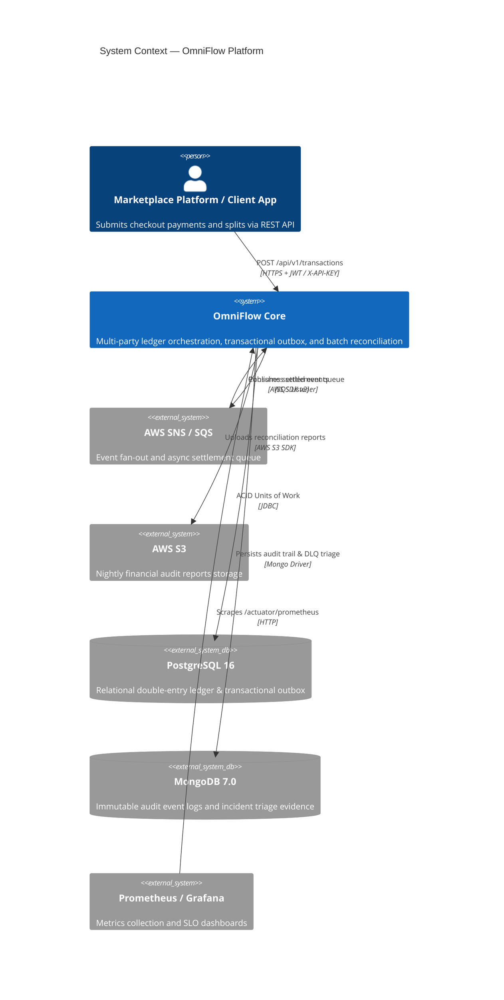
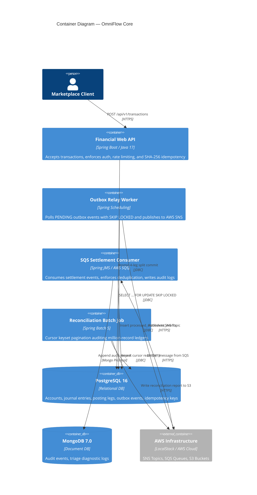
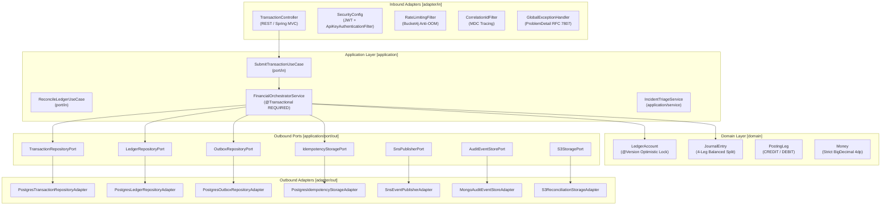
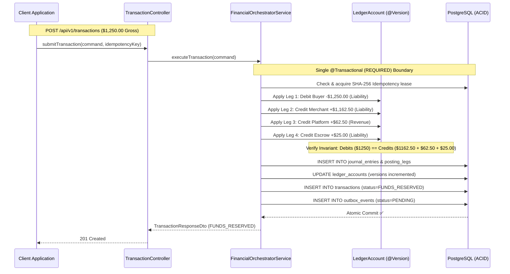
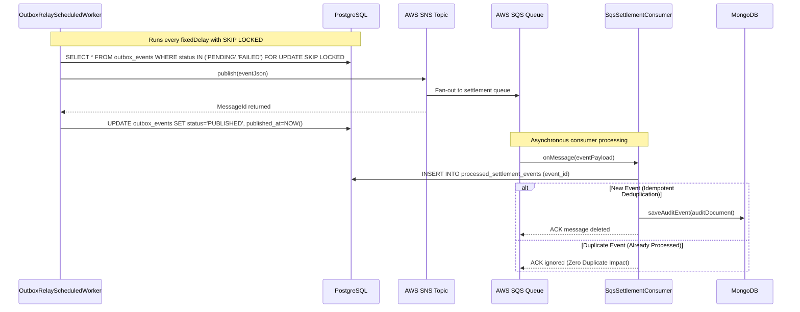

# OmniFlow — Architecture Diagrams

## C4 Level 1 — System Context

---

## C4 Level 2 — Container Diagram

---

## C4 Level 3 — Component Diagram (Hexagonal Architecture)

---

## 4-Leg Marketplace Split Accounting Sequence

---

## Transactional Outbox & AWS SNS/SQS Delivery

